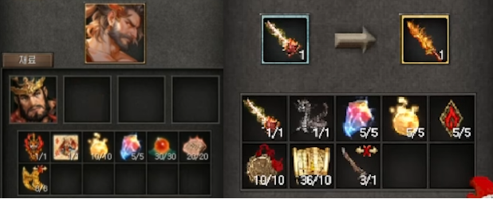
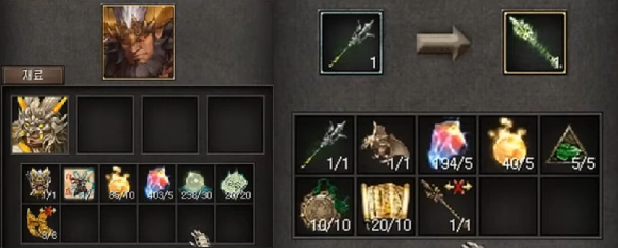
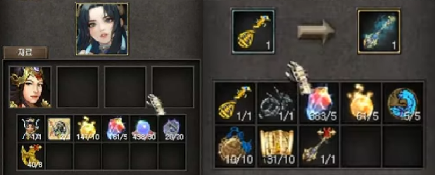
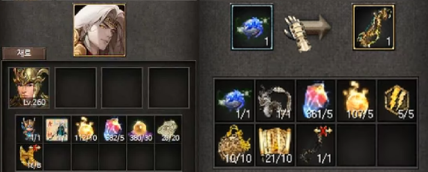

# 覺醒天王

可透過「須彌山」9點鐘方向的「帝釋天的使者」NPC覺醒天王

天王須達到260等級、信用等級130以上才可進行覺醒

可透過「須彌山」9點鐘方向的「帝釋天的使者」NPC製作覺醒天王武器

達到200等級以上才可透過「操練師_幻」NPC將幻獸「火龍」、「雷龍」、「風龍」、「水龍」封印為石像

## 覺醒持國天王

<figure markdown>
{ loading=lazy}
</figure>

覺醒「持國天王」需要「武神的持國天王」、「神獸符朱雀(朱雀)」、「力量的根源」、「覺醒石」、「精氣之珠(火)」、「記憶的書板(火)」、「[遺物] 法輪碎片」道具。

「覺醒天王劍」需要「<強韌的> 高級天王劍」、「火龍之石像」、「覺醒石」、「力量的根源」、「死神印章(火)」、「高貴的力量飾品(火)」、「力量的記憶」、「[遺物] 磨損的覺醒天王劍」道具。

---

穿戴「覺醒天王劍」

使用技能時，會額外發動「火龍」、「古代火龍」，受到「古代火龍」傷害的怪物會額外減少5%魔法抵抗。變更「火龍」技能傷害計算公式，因「古代火龍」所減少的5%魔法抵抗最多可累積到30%。

### 技能特性

|  名稱 |  焰火無極陣 |
|---|---|
|  範圍 |  13 x 13 格  |
| 發動距離  | 21 格  |
| 效果  | 附帶持續5秒的灼傷傷害, 威力隨特性增加 |
| 效果2 | 「焰火無極陣」將根據使用次數疊加灼傷傷害，疊加時會增加傷害並更新持續時間，最多可疊加10次。|

|  左邊特性         | 1 | 2  | 3 | 4  | 5  | 
|---|------|---|---|---|---|
|  火劫   焰火無極陣傷害增加N%   | 20% | 40%  | 70%  | 100%  | 150%  | 
|  經眼   根據範圍內敵人數量最多10個 / 傷害增加N％  | 5% | 10%  | 15%  | 20%  | 40% 施法距離+2  | 

|  右邊特性         | 1 | 2  | 3 | 4  | 5  | 
|---|------|---|---|---|---|
|  灼傷   燃燒傷害加N％ / 魔法抗性降低N％ | 20%／1％ | 50％／3％  | 100％／6％  | 150％／10％  | 200％／15％   | 
|  層火   每層燒傷加N% / 持續時間加N秒  | 2%／2秒 | 5%／3秒  | 20%／5秒  | 50%／7秒  | 100%／10秒 燒傷效果2倍  | 

## 覺醒廣目天王

<figure markdown>
{ loading=lazy}
</figure>

覺醒「廣目天王」需要「武神的廣目天王」、「神獸符白虎(白虎)」、「力量的根源」、「覺醒石」、「精氣之珠(風)」、「記憶的書板(風)」、「[遺物] 法輪碎片」道具。

「覺醒天王戟」需要「《韌性的》高級天王戟」、「風龍石像」、「覺醒石」、「力量根源」、「逆流死神印章（風）」、「高貴力量飾品（風）」、「力量記憶」、「[遺物] 磨損覺醒天王戟」。

---

穿戴「覺醒天王戟」

「風極盡滅」傷害的目標會減少35%移動速度。使用技能時，會額外發動「風龍」「古代風龍」，受到「古代風龍」傷害的怪物會額外減少2%打擊抵抗。因「古代風龍」所減少的2%打擊抵抗最多可累積到30%。

### 技能特性

|  名稱 |  風極盡滅 |
|---|---|
|  範圍 |  13 x 13 格  |
| 發動距離  | 21 格  |
| 效果  | 會受到生命力影響且對地面怪物造成傷害 |

|  左邊特性         | 1 | 2  | 3 | 4  | 5  | 
|---|------|---|---|---|---|
|  狂風   風極盡滅傷害增加N%   | 20% | 40%  | 70%  | 100%  | 150%  | 
|  連破   廣目天王的生命力增加N％  | 5% | 10%  | 15%  | 20%  | 40% 增加固定傷害  | 

|  右邊特性         | 1 | 2  | 3 | 4  | 5  | 
|---|------|---|---|---|---|
|  衝突   目標的打擊抵抗力抗性降低N％ | 1％ | 3％  | 6％  | 10％  | 15％   | 
|  神步   每次攻擊加風極盡滅 N% 傷害  | 2% | 5% | 20%  | 50%  | 100% 增加射程距離與傷害減少率  | 

## 覺醒多聞天王

<figure markdown>
{ loading=lazy}
</figure>

覺醒「多聞天王」需要「武神的多聞天王」、「神獸符玄武(玄武)」、「力量的根源」、「覺醒石」、「精氣之珠(水)」、「記憶的書板(水)」、「[遺物] 法輪碎片」道具。

「覺醒天王琵」需要「<神秘的> 高級天王琵」、「水龍之石像」、「覺醒石」、「力量的根源」、「死神印章(水)」、「高貴的力量飾品(水)」、「力量的記憶」、「[遺物] 磨損的覺醒天王琵」道具。

## 覺醒增長天王

<figure markdown>
{ loading=lazy}
</figure>

覺醒「增長天王」需要「武神的增長天王」、「神獸符青龍(青龍)」、「力量的根源」、「覺醒石」、「精氣之珠(雷)」、「記憶的書板(雷)」、「[遺物] 法輪碎片」道具。

「覺醒天王珠」需要「<迅速的> 高級天王珠」、「雷龍之石像」、「覺醒石」、「力量的根源」、「死神印章(雷)」、「高貴的力量飾品(雷)」、「力量的記憶」、「[遺物] 磨損的覺醒天王珠」道具。