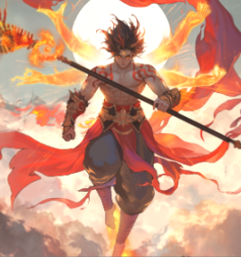

# 哪吒的試煉 (Trial of Nezha)

<figure markdown>
  { loading=lazy }
</figure>

「哪吒的試煉」是《巨商》在 2025 年 5 月推出的重大商團討伐內容。這是一個需要商團成員通力合作的副本，包含隊長與 BOSS 的一對一對決，以及隊員的支援與貢獻系統。

## 入場條件與資訊

!!! info "基本資訊"
    - **商團要求**：商團等級需達 LV15 或 LV25 (需啟用技能)
    - **隊長要求**：250級以上
    - **隊伍限制**：4～5人專用隊伍，加入商團滿 10 天方可參加。
    - **重置時間**：每月 1 日及 16 日 00:34。
    - **鎖定時間**：每月 1 日及 16 日 00:00 - 01:00 (期間無法入場)。

### 如何進入
1. 前往所屬商團的主城。
2. 點擊城內建築 **Town** -> **Guild**。
3. 選擇 **Meeting Room (商團會議室)**。
4. 支付 **30 萬** 費用後即可進入尋找 NPC。

## 戰鬥機制

哪吒試煉採用「隊長對決 + 隊員支援」的模式：

- **隊長戰**：隊長進入與 BOSS「哪吒」的一對一戰鬥。哪吒共有三個階段的變身。
- **隊員支援**：隊員在各自的地圖中消滅特殊怪物 (如混天綾、乾坤圈碎片) 獲得貢獻度。
- **增益效果**：隊員消滅指定怪物後，會為隊長提供防護罩或其他增益，幫助隊長度過難關。
- **恢復機制**：每個階段擊敗哪吒後，會召喚「等待石」，可恢復隊伍所有成員的體力與法力。

## 獎勵

!!! success "獎勵彙整"
    - **貢獻度獎勵**：每 100 貢獻度獲得 1 個 **[討伐] 經驗值書**。
    - **一般難度最終獎勵**：包含深淵的精髓、弱化的哪吒裝備 (不可交易)、四神戒指等。
    - **困難難度最終獎勵**：除一般獎勵外，新增 **死神精氣** 與 **各屬性死神印章**。

### 核心掉落物
- **弱化的哪吒套裝**：包含金磚、風火輪、火尖槍、陰陽劍。
- **哪吒魂馬素材**：用於製作坐騎「哪吒的魂馬」。

## 成就與稱號
- **成就**：「哪吒的試煉」。
- **稱號**：「哪吒的弟子」。
