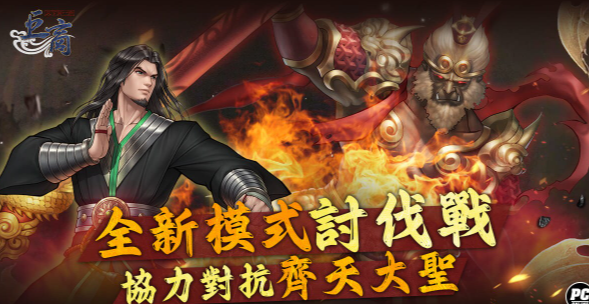
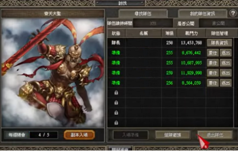
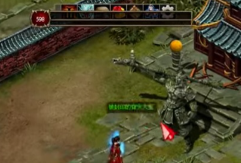
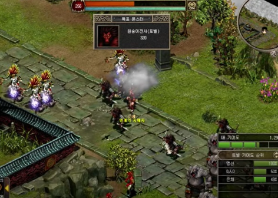
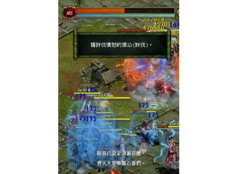
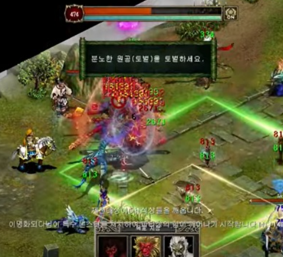
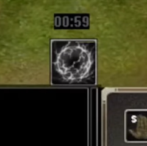
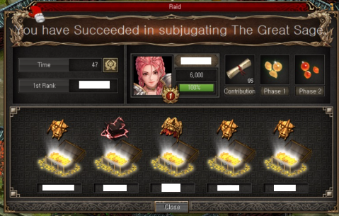

# 馬騮討伐戰

<figure markdown>
  { loading=lazy }
</figure>

## 前置任務 

### 條件190LV (完成才有通行證)

1. Anlian村莊找NPC - Master Min (做白虎團任務那個NPC) 接100隻Spirited Monkey的任務
2. 到Jiangluo附近打100隻Spirted Monkey
3. 完成第一個任務, 再跟Master Min接任務, 對話多一次完成任務
4. 到Jiangluo村莊找NPC - Wan Fu接任務, 交10個Root of life完成

!!! 重置時間
    星期日 下午1點33分 (冬令) / 12點33分 夏令

## 隊長／隊員建議要求：

### 隊長

1. 主角要250等級或以上
2. BOSS 主要輸出為法術攻擊, 建議帶(金 / 朱蒙) 來增加法抗
3. 精靈建議帶風精靈增加走位速度
4. 強烈建議要有持續回血手段(例如2轉明女/台男)／放盾手段(印度天使)／或打手血夠多不易死（例如虎天陣）
5. 需要有足夠輸出打王 (可以帶西槍對BOSS放鬼魂彈增加傷害)
目標是在５分鐘保住打手不死，同時夠傷害把王的３階段都打死

### 隊員

1. 需要主角190等級或以上
2. 起碼有狐娃 / 有高馬武的馬水平的打手
打手之外的位置都可以放其他兵來刷怪吸經

## 基本流程

=== "1"
    <figure markdown>
        { loading=lazy }
    </figure>

    由主角250等級以上的玩家點擊齊天大聖石像，開啟討伐UI頁面，創建隊伍 (做隊長)。然後組4位隊員(建議人數齊5人)，全部隊員準備好的狀態下，由隊長點擊Enter(右圖副本入場位置按鈕)入場

    創建隊伍可以設密碼，只跟朋友打

    隊長可以踢人／交給其他人做隊長
    隊員可以查看隊長陣容和裝備

=== "2"
    <figure markdown>
        { loading=lazy }
    </figure>

    「討伐」中隊長的進行情況如下：
    隊伍入場後，隊長點擊「被封印的齊天大聖」，即進行與BOSS1對1的戰鬥。
    BOSS將經過3階段變身，隊長消滅3階段BOSS時，即討伐成功。

    若隊長從戰鬥中撤退或隊長的所有傭兵皆死亡時，即討伐失敗。
    進入討伐後，若超過10分鐘，即討伐失敗。

=== "3"

    <figure markdown>
        { loading=lazy }
    </figure>

    「討伐」中隊員的進行情況如下：
    隊長與BOSS進行1對1戰鬥的期間，討伐怪物將出現於隊員所在的地圖。
    與原有怪物相比，消滅討伐怪物可獲得更多經驗值。
    討伐戰鬥中，所有隊員將進行個別戰鬥。
    隊員將自動套用挑釁符和迴避符，主角死亡時立即復活。
    與討伐怪物戰鬥時，隊員將在無敵增益模式、強化增益等狀況下消滅特殊怪物。
    該行動可獲得「討伐」貢獻度，並根據貢獻度發送獎勵。

=== "4"

    <figure markdown>
        { loading=lazy }
    </figure>

    隊長進場跟BOSS 1對1戰鬥，把BOSS打至半血，當BOSS的體力低於50%時，BOSS將發動無敵增益效果，不受傷害。BOSS進入無敵狀態時，隊員的地圖上將會出現特殊怪物「猴戰士(討伐)」、「猴咒術士(討伐)」、「憤怒的猿公(討伐)」，需消滅該怪物中特定1種的指定數量後(280隻)才可解除BOSS的無敵增益效果。   
    另外，隊員消滅特定怪物時，可獲得貢獻度。
    BOSS使用無敵增益效果的同時，隊長將會看到特定怪物的資訊。(如圖所示)
    隊長可透過聊天或位於下方的目標設定UI告知隊員關於特定怪物的資訊。

    隊員一進場，可以先打其他怪物刷經驗，直到隊長告知要打那一款指定怪物

    BOSS無敵，等隊員打怪的時候，隊長可以繞場不停走動走避免被BOSS出技打中

=== "5"

    <figure markdown>
        { loading=lazy }
    </figure>

    隊員消滅指定怪物後，BOSS的無敵會消失，此時隊長可以把BOSS打死，令其變身為第２階段，再把第２階段的BOSS打至半血，然後BOSS又會開啟無敵，重複第4點步驟，隊長繞場不停走動避免被BOSS出技打中，隊員負責消滅特定怪物

    隊員再次消滅指定怪物後，BOSS的無敵會消失，此時隊長可以把BOSS打死，令其變身為第３階段，再把第３階段的BOSS打至半血，然後BOSS又會開啟無敵，重複第4點步驟，隊長繞場不停走動避免被BOSS出技打中，隊員負責消滅特定怪物

    隊員再次消滅指定怪物後，BOSS的無敵會消失，此時隊長可以把BOSS打死，成功通關

## BOSS的行動模式

>BOSS的行動模式有兩種，分別為一般狀態和無敵狀態

一般狀態時有兩種攻擊手段：`近程範圍落雷`及`分身龍卷`
落雷只要不太接近BOSS，或召坦就不會中招。但要注意一旦中招會短時間內無法行動
需要警戒的是分身龍卷，會無預警在`打手`位置出現分身卷起龍卷
傷害不算高但亦需要持續回復／護盾以抵擋。
一般狀態時注意保持天使護盾，龍卷出現時移動本隊即可。

!!! tip "Tips"
    分身龍卷會優先出現在`打手`身上，`打手`和本陣分開可降低補血/補盾壓力

無敵狀態時只有一種攻擊手段：範圍落雷
落雷前會在範圍內出現四方格，過一段時間後在四方格範圍內落雷
中招單位會受到傷害及一段時間無法行動
這招時間延遲較長，出現四方格後移動即可。基本上不成威脅。
無敵期間BOSS會不停召喚分身，分身只會普攻，傷害偏低，建議靠台／日冥自動排除。

## 隊長技能

<figure markdown>
{ loading=lazy }
</figure>

戰鬥中，隊長可使用位於組合技能附近的「強化增益效果」。
戰鬥開始的同時，「強化增益效果」技能有1分30秒的冷卻時間，使用後有2分10秒的冷卻時間。

使用「強化增益效果」技能時，增益效果怪物「齊天大聖(分身)」、「擁有氣息的猴子(討伐)」將出現於隊員的地圖。
消滅位於地圖的增益效果怪物達目標數量時，隊長將會獲得10秒內增加50%傷害的增益效果。

>消滅「齊天大聖(分身)」時，可獲得比「擁有氣息的猴子(討伐)」更多的消滅數量。

>消滅增益效果怪物時可獲得貢獻度，消滅「齊天大聖(分身)」可獲得更多貢獻度。

## 獎勵

<figure markdown>
{ loading=lazy }
</figure>

完場後會彈出結算介面，成功通關隊長和隊員都會有1個寶箱隨機抽物品

消滅「討伐」齊天大聖1階段、2階段時，可獲得覺醒石碎片、被封印的力量碎片、生命的精髓、精氣之珠碎片(地)、精氣之珠碎片(風)、精氣之珠碎片(雷)、精氣之珠碎片(水)、精氣之珠碎片(火)等。

消滅「討伐」齊天大聖最終階段時，可獲得覺醒石碎片、被封印的力量碎塊、深淵的精髓、精氣之珠碎片(地)、精氣之珠碎片(風)、精氣之珠碎片(雷)、精氣之珠碎片(水)、精氣之珠碎片(火)、齊天大聖的黃金裝飾碎片、齊天大聖盔甲碎片、齊天大聖的厚皮、蘊含齊天大聖氣息的毛、修羅戒指、密特拉戒指、司令戒指、毀滅者戒指等。

隊長有低機率獲得齊天大聖盔甲(綁定)、齊天大聖頭盔(綁定)等，並小幅提升戒指類等部分道具的獲得機率。

!!! info "經驗值書"
    每100「討伐」貢獻度，可獲得1個[討伐]經驗值書(500萬)(不可交易)道具。

    每400「討伐」貢獻度可額外獲得7個[討伐]經驗值書(500萬)(不可交易)道具作為區間獎勵
    
    此區間獎勵最多套用至2,000貢獻度。

!!! warning "注意" 
    「討伐」貢獻度為0的玩家無法獲得獎勵。

## 怪物掉落物

「擁有氣息的猴子」會掉落「天龍念珠」、「生命的精髓」、「中級精髓」。

「齊天大聖3階段」會掉落「天雷草(不可交易)」。

「齊天大聖(分身)」會掉落「天龍念珠」、「生命的精髓」、「被封印的力量碎片」。

「雷電的天狗(討伐)」會掉落「水晶法杖」。

「雷電的邪靈術師(討伐)」會掉落「天龍念珠」。

「三尾狐(討伐)」會掉落「天龍念珠」。

「巨口鬼(討伐)」會掉落「鈴鐺刀」。

「猴戰士(討伐)」會掉落「天龍念珠」。

「猴咒術士(討伐)」會掉落「天龍念珠」。

「憤怒的猿公(討伐)」會掉落「天龍念珠」。

## NPC可交換/製作的物品

齊天大聖盔甲(綁定)：

>需要6個齊天大聖的黃金裝飾碎片、6個齊天大聖盔甲碎片、6個齊天大聖的厚皮。

齊天大聖頭盔(綁定)：

>需要4個齊天大聖的黃金裝飾碎片、4個齊天大聖盔甲碎片、蘊含齊天大聖氣息的毛。

[討伐]經驗值書(億)(不可交易)：

>需要20個[討伐]經驗值書(500萬)(不可交易)道具。

## 影片教學

<iframe width="560" height="315" src="https://www.youtube.com/embed/JedatGuDXAU" title="YouTube video player" frameborder="0" allow="accelerometer; autoplay; clipboard-write; encrypted-media; gyroscope; picture-in-picture; web-share" allowfullscreen></iframe>