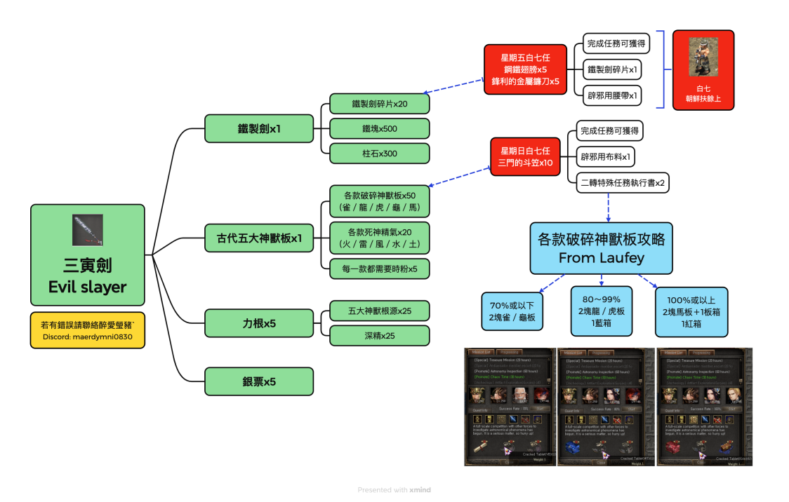
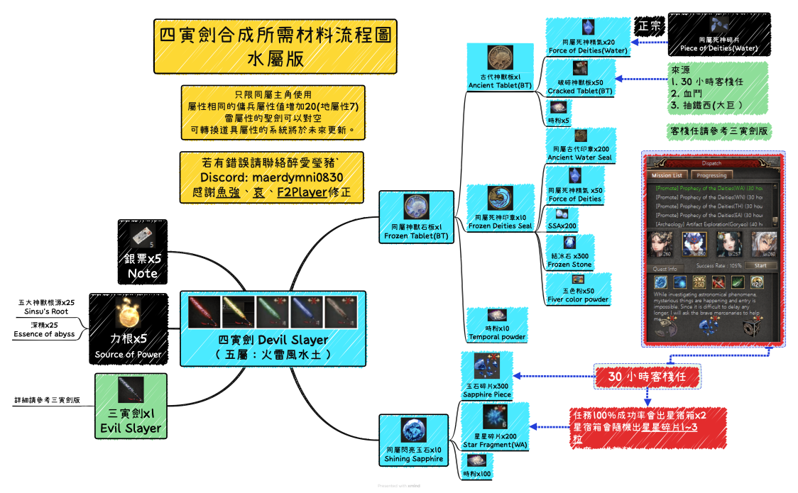

# 寅劍 (Sain Swords)

三寅劍和四寅劍是《巨商》中後期非常強力的主角專用武器。

=== "三寅劍 (Sam-In Sword)"
    ## 基本資訊
    | 等級 | 體力 | 智力 | 技能 |
    | :--- | :--- | :--- | :--- |
    | 235 | +50 | +250 | 銀河水 (Galaxy Water) |

    ## 製作材料
    - 青銅劍 (不可交易) x1
    - 古代朱雀石板 x1
    - 古代玄武石板 x1
    - 古代白虎石板 x1
    - 古代青龍石板 x1
    - 古代麒麟石板 x1
    - 力的根源 x5
    - 1億錢幣支票 x5

    !!! note "說明"
        此武器不可交易。

    <figure markdown>
      { loading=lazy }
    </figure>

=== "四寅劍 (Sa-In Sword)"
    ## 基本資訊
    | 等級 | 力量 | 體力 | 智力 | 屬性值 | 技能 |
    | :--- | :--- | :--- | :--- | :--- | :--- |
    | 250 | +100 | +70 | +250 | +20 | 強化銀河水 |

    !!! info "版本"
        四寅劍共有五種版本：火、水、風、雷、地。

    ## 製作材料 (以火屬性為例)
    - 三寅劍 (不可交易) x1
    - 燃燒的朱雀石板 (不可交易) x1
    - 閃耀的紅玉 x10
    - 力的根源 x5
    - 1億錢幣支票 x5

    !!! note "說明"
        此武器不可交易，製作時需根據目標屬性準備對應的石板與寶石。

    <figure markdown>
      { loading=lazy }
    </figure>
