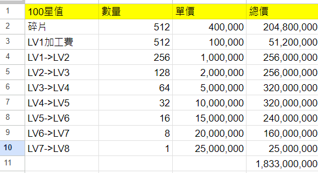

# 星宿系統

<figure markdown>
  { loading=lazy }
</figure>

新增2轉主角的共同特性「星宿」。

可透過位於匡廬山最高峰北邊的NPC「嚮導_聖原」開始星宿任務，完成任務時，2轉主角將獲得「星宿」特性。
獲得「星宿」特性時，根據主角的屬性可從東方七宿(雷)、北方七宿(水)、西方七宿(風)、南方七宿(火)、天上七宿(土)星宿中獲得一種星宿。
2轉主角獲得「星宿」特性後，「四天王」、「明王」、「傳說武將」也會啟用「星宿」特性，並可透過「特殊技能」選單確認「星宿」資訊。
擁有星宿特性的角色，持有星痕上限為「140」，當持有「100」以上的星痕時，即會套用套裝效果。
可透過位於匡廬山最高峰的「NPC_舍利弗」製作星宿道具及執行強化任務。
星宿道具可進行強化，強化階段越高星痕也會越高。

獲得「星宿」特性後，使用「重生之書」、「歸化誓約」、「職業書」時，將變更為已變更屬性的星宿插槽資訊。
2轉主角獲得「星宿」特性後，與7等級以上怪物戰鬥時，有機率獲得「星之原石」道具。

## 星座成本

{ loading=lazy}

## 星值 100 成本
{ loading=lazy}

