# 靈異怪談

<figure markdown>
  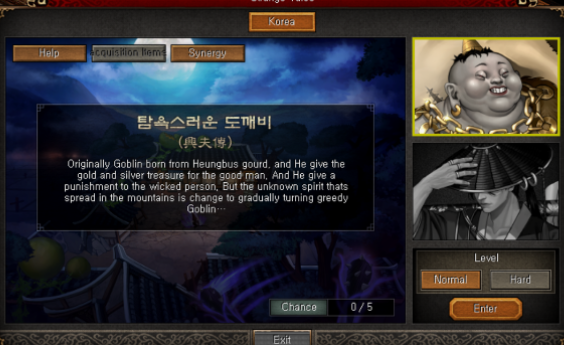{ loading=lazy }
</figure>

## 參加方法

>可透過位於武道場的NPC 說書人_敬虎 進行。
「靈異怪談」的各BOSS難易度皆有「一般」及「困難」主角至多可與5名傭兵參與戰鬥，入場的所有成員將增加移動速度。
入場「靈異怪談」的四天王、明王、覺醒凶獸、凶獸、神獸、傳說武將、改造武將、覺醒武將、主角、龍族幻獸將增加力量、敏捷、體力、智力。

根據位於傭兵欄位的傭兵組合，可得到戰鬥優勢的 傭兵互助 功能。
「靈異怪談」的BOSS將根據一定生命、條件，使用特殊模式。
「靈異怪談」的BOSS狂暴化指數於戰鬥時間每2秒增加1%，達到100%時將進行狂暴化。

可透過「靈異怪談」 UI的幫助查看戰鬥系統。

完成「靈異怪談」時，可達成成就。

!!! info "參加時間"
    晚上11點 ~ 凌晨1點無法使用靈異怪談。

## 獎勵

靈異怪談 完成時，可根據戰鬥怪物、難易度獲得獎勵。

>貪婪的獨角鬼 可獲得「貪婪的獨角鬼袋子」
必定獲得 獨角鬼木棒，且可隨機獲得 不死神符、變身令書禮包、小型屬性石等。

>紈絝道士率居 可獲得「率居故事禮包」
必定獲得 率居毛筆 ，且可隨機獲得 不死神符、變身令書禮包、小型屬性石等。

進行「靈異怪談」 困難 難易度時，可獲得分數，以BOSS剩餘生命、剩餘戰鬥時間、參加戰鬥之傭兵裝備能力值的總和 /10計算。

根據「靈異怪談」綜合分數結果，第1名 ~ 第30名可獲得每周獎勵，排名於每周一初始化。

根據「靈異怪談」綜合分數結果，第1名 ~ 第30名可獲得每月獎勵，將發放給每月第1名 率居斗笠、率居道服，排名於每月第一個周一初始化。

!!! warning "注意" 
    Normal難度過關不會有分數，Hard難度才有分數

!!! info "每周獎勵「敬虎的寶箱」"
    可隨機出現 經驗值書、不穩定的陣型書、故事票券、小小、一石二鳥 5日、迴避符 1日、挑釁符 7日、天照大神頭冠製造書、天照大神盔甲製造書、神仙丹藥 7日、歸化誓約、神獸石像等。

!!! info "每月獎勵「敬虎的下級故事袋」"
    必定獲得 蘊含力量的率居畫作 ，且可能隨機出現 精鍊的獨角鬼火、墨畫的羽毛、強化的白水晶(+3)、強化的砂金石(+3)、強化的月長石(+3)、強化的黑曜石(+3)、瘟神之石像(200等級)、猿公之石像(200等級)、雷獸之石像(200等級)、虎鶴之石像(200等級)、持國天王的手臂護具、持國天王的腰帶、持國天王的鞋子、多聞天王手腕護套、多聞天王腰帶、多聞天王鞋子、廣目天王的手臂護具、廣目天王的腰帶、廣目天王的戰鬥靴、增長天王的手腕護具、增長天王的腰帶、增長天王的戰鬥靴等。

!!! info "每月獎勵「敬虎的中級故事袋」"
    可能隨機出現 挑釁符-7日、神仙丹藥-7日、挑釁符-30日、神仙丹藥-30日、白虎之石像(200等級)、朱雀之石像(200等級)、玄武之石像(200等級)、青龍之石像(200等級)、盤古的項鍊(+5)、盤古的耳環(+5)、天樞 黑曜石、天璇 月長石、天璣 白水晶、天權 砂金石、玉衡 赤血石、持國天王之冠、多聞天王頭戴、廣目天王的面具、增長天王的頭盔等。

!!! info "每月獎勵「敬虎的高級故事袋」"
    必定獲得蘊含力量的率居畫作、精鍊的獨角鬼火、墨畫的羽毛，且可能隨機出現 北斗七星 黑曜石、北斗七星 月長石、北斗七星 白水晶、北斗七星 砂金石、北斗七星 赤血石、持國天王之禮服、多聞天王禮服、廣目天王的盔甲、增長天王的盔甲等。 

## 傭兵組合

=== "貪婪的獨角鬼"

    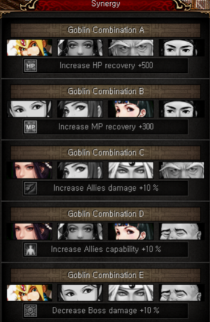{ loading=lazy, align=left}

    實際建議：

        1. 組合Ｂ＋Ｃ

        2. 組合Ｂ＋Ｄ

        3. 組合Ｃ＋Ｄ（此為追求高分才需要用）

=== "紈絝道士率居"

    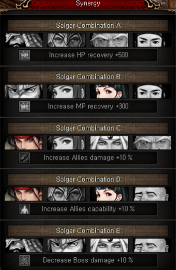{ loading=lazy, align=left}

    實際建議：

        1. 組合Ｂ＋Ｃ

        2. 組合Ｂ＋Ｄ

## 機制分析 

=== "貪婪的獨角鬼"

    | 攻擊模式      | 描述                         |
    | ----------- | ------------------------------------ |
    | 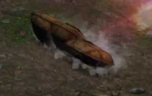{ loading=lazy} | 沙包滾動攻擊 
 對策：走位避開，就算被佢打中都唔會秒殺 |
    | 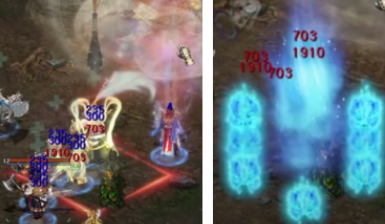{ loading=lazy} | 地面會出現一個紅色框，１秒後會獨角鬼棒跌下來，在地面燒出藍火後再爆出８個藍火球 
 對策：有框就要立即走位避開，傷害很高，被打中有機會直接死兵 |
    | 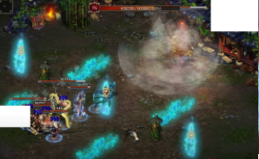{ loading=lazy} | 三行倒數，此時王會無敵不會扣血
注意Normal難度和Hard難度對策不同，沒有走到正確位置就會被秒殺
Normal難度對策：需要把全隊控制行去不是最短秒數的另外兩行其中一行，待最短秒數那行倒數完後，全隊控制行去沒有數字倒數那行，站到其餘兩行也倒數完結便可

Hard難度對策：需要把全隊控制行去最短秒數那一行，倒數完後要馬上行去接下來準備數完的那一行，同樣倒數完後要再行去最後倒數那一行 |
    | 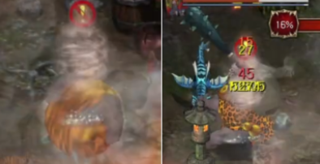{ loading=lazy} | 獨角鬼本體滾動攻擊，撞到場境中的阻礙物會停下和暈眩 
 對策：走位避開，就算被佢打中都唔會秒殺；王暈眩時是全力輸出好時機 |
    | 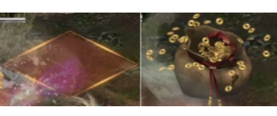{ loading=lazy} | 空中掉錢袋攻擊 
 地面會出現一個有底色的方框，約2.5秒後會掉落一個錢袋，被打中會有機會秒殺 
 對策：走位避開 |
    | 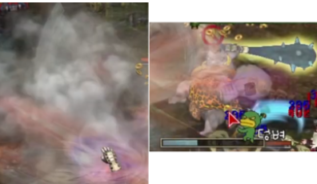{ loading=lazy} | 王會突然無敵短時間，然後會閃現到場地中間，而且底下會出現一條Ｂａｒ 
 對策：盡快全力輸出把王底下的Ｂａｒ打滿，時間內打唔滿就會被王用雷電攻擊扣全隊血，有機會被秒殺；時間內打唔滿；時間內打滿後，王會進入一段時間暈眩，是全力輸出好時機 |
    | 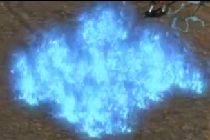{ loading=lazy} | 王會拋出一粒藍色火球，慢慢飛到你的陣容，到地面後會變成一片藍火海，被打中會扣ＭＰ和血，而且此藍火海不會消失，同時最多出現３次此技能 
 對策：走位避開 |

=== "紈絝道士率居"

    | 攻擊模式      | 描述                         |
    | ----------- | ------------------------------------ |
    | 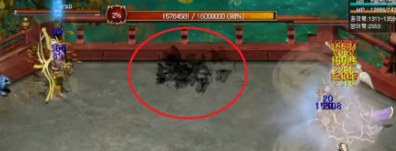{ loading=lazy} | Ｂｏｓｓ普通攻擊 
 對策：指定技能，不用避開和理會 |
    | 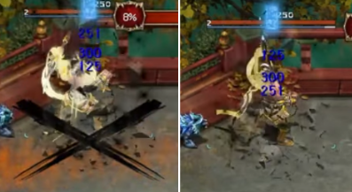{ loading=lazy} | 地面會出現一個＂Ｘ＂, 約２秒後會做成約３—４秒的持續範圍傷害 
 對策：走位避開，被打中傷害很高，有機會死兵 |
    | 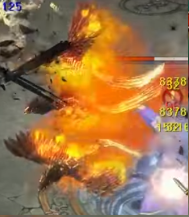{ loading=lazy} | 王會射出３隻斜／直線的火焰鳥 
 對策：走位避開，被打中傷害很高，有機會死兵 |
    | 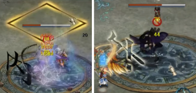{ loading=lazy} | 王會閃現到場中間，隨機地點會出現一個黃色方框，然後出現內／外字 
 對策：內字 — 需要在３秒內把全隊走到框內，時間到沒進框的會被王固定直接秒殺
外字 — 不要進框就好，此時可以全力輸出 |
    | 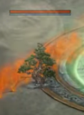{ loading=lazy} | 場中間會出現３樹，一段時間後會變成怪，會移動和攻擊你本陣 
 對策：出技把樹打死就好，大概２—３下技能就清完；如不打死王會殘血後鎖血（未確認） |
    | 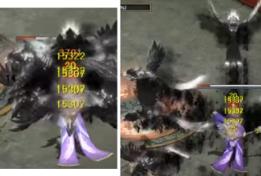{ loading=lazy} | 王會射出８隻斜／直線的黑鳥 
 對策：走位避開，被打中傷害很高，有機會死兵 |
    | 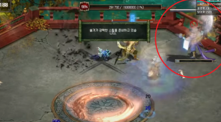{ loading=lazy} | 王殘血時１００％會閃現回最初的位置，然後無敵，底下會出現一條Ｂａｒ 
 對策：盡快全力輸出把王底下的Ｂａｒ打滿，時間內打唔滿就會被王用鬼手攻擊秒殺全隊，打滿就可以解除王的無敵，直接把王打死 |

!!! tip "實用小技巧"
    在一開始NPC對話階段，可以先不用急按左下角的Skip，此時已經可以先用Ctrl出技能，預先放坦／開日女武技等，再按Skip

## 實戰影片

=== "貪婪的獨角鬼"

    | 影片      | 連結                         |
    | ----------- | ------------------------------------ |
    |虎天打Normal難度|		[click](https://www.youtube.com/watch?v=89QN82ktYUA)	|				
    |虎天打Hard難度	|	[click](https://www.youtube.com/watch?v=t2dYnOZ4z2s&t=3s) |					
    |雀天打Normal難度|		暫無，如有影片歡迎提供				|	
    |雀天打Hard難度	|	暫無，如有影片歡迎提供					|
    |龍天打Normal難度|		暫無，如有影片歡迎提供					|
    |龍天打Hard難度	|	[click](https://www.youtube.com/watch?v=xyIozeL6NYw)	|				
    |龜天打Normal難度|		暫無，如有影片歡迎提供					|
    |龜天打Hard難度	|	[click](https://www.youtube.com/watch?v=DsR8bdmY9j0&t=32s)					|

=== "紈絝道士率居"

    | 影片      | 連結                         |
    | ----------- | ------------------------------------ |
    |虎天打Normal難度|		[click](https://www.youtube.com/watch?v=lbzksoP5MPc)		|		
    |虎天打Hard難度	|	[click](https://www.youtube.com/watch?v=t2dYnOZ4z2s&t=3s)		|			
    |雀天打Normal難度|		暫無，如有影片歡迎提供					|
    |雀天打Hard難度	|	[click](https://www.youtube.com/watch?v=z1d8YkC0bug&t=18s) |					
    |龍天打Normal難度|		暫無，如有影片歡迎提供					|
    |龍天打Hard難度	|	[click](https://www.youtube.com/watch?v=rkOWVpCB6q8)	|				
    |龜天打Normal難度|		暫無，如有影片歡迎提供					|
    |龜天打Hard難度	|	[click](https://www.youtube.com/watch?v=DsR8bdmY9j0&t=32s) |					