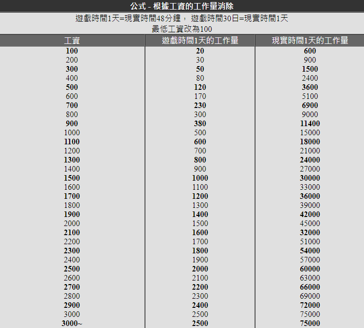
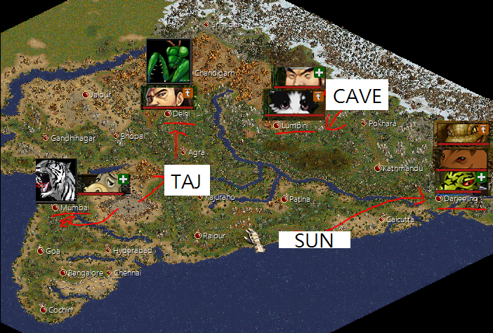
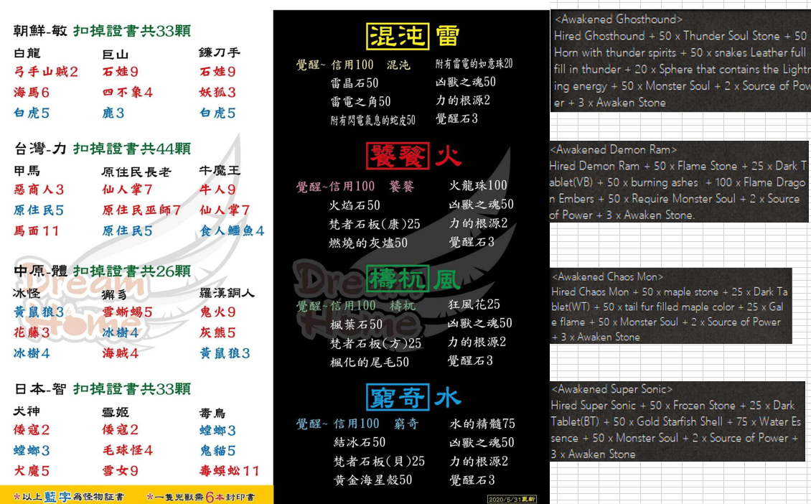

# 雜項

## 考古懶人包

1. 前置: 2轉主+ 開考古要一粒帝印 Seal of the Yellow Emperor。
2. 打山頂或以上(非日月天)既怪時，有機會趺兩種地圖，普通/屬性(打同屬怪)地圖，仲要打死入面隻王。
3. 普通地圖有1/26機會開到法輪碎片(覺天要8粒)。
4. 屬性地圖有1/27機會開到法輪碎片或同屬覺天武素材(要1粒)。目前只有火風地圖。
5. 任送1粒法輪碎片，周任送3張普通地圖。

>Credit by cheongcheong

## 工作量公式

{ loading=lazy}

## 轉印兵地點

{ loading=lazy}

## 轉印怪地點

{ loading=lazy}

## 降抗等級比

{ loading=lazy}

## HSS (英雄靈魂石) 轉換比例

{ loading=lazy}

## 兇獸成本

{ loading=lazy}
>Edited by 韓龍